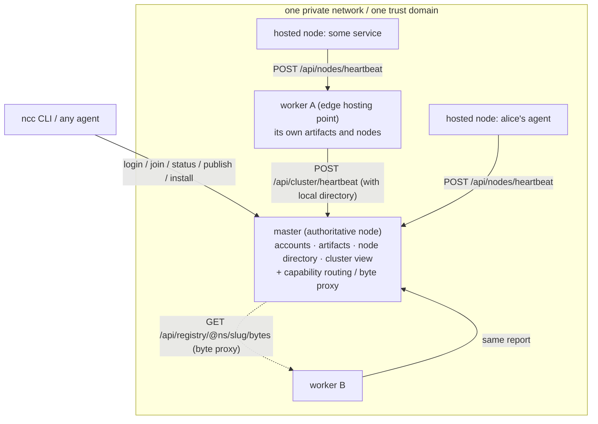

# ncc-registry — a self-hosted registry node for your own network

> English | [中文](README.zh-CN.md)

A **single-binary** registry service that puts **artifact hosting**, **configuration hosting**,
**share links**, **node hosting**, **agent discovery & interconnection**, and **node governance**
into one process — and scales out as **multiple nodes** (one `master` plus any number of `worker`s).

It is part of the open, self-hostable [`ncc`](https://github.com/fusedmodel/ncc) project:
one Go binary, one SQLite file, a built-in web console, no external database and no object storage
required to get started. Change history lives in [`CHANGELOG.md`](CHANGELOG.md).

```bash
go build -o dist/ncc-registry ./cmd/ncc-registry
NCCR_PORT=8282 ./dist/ncc-registry          # → http://localhost:8282
```

It is also an **importable Go library** (`module github.com/fusedmodel/ncc-registry`) — to embed a
registry node in your own process, see [Using it as a Go library](#using-it-as-a-go-library).

**Requirements**: Go 1.24+ to build from source (or use the published Docker image / the prebuilt
binaries from Releases). No external database, no object storage and no other NCC component is needed.

**When it is useful**: you have agents, skills, packages and services scattered across machines on a
private network, and you want one address that answers "what exists here, who provides it, who is
allowed to fetch it, and what changed" — without standing up a database cluster or handing your
bytes to a third party.

## What it does

| Capability | Description | Main endpoints |
|---|---|---|
| **Artifact hosting** | Accounts / namespaces / publish / search / download / replication; `sha256` verification and a stable `@namespace/slug` reference | `/api/auth/*`, `/api/registry*` |
| **Hosted nodes** | Users **register + heartbeat** the agents and services running on their network, declaring *who I am, where I am, what I can do* | `/api/nodes/heartbeat`, `/api/nodes` |
| **Agent discovery & interconnection** | Discover each other inside one trust domain, keep a connection list, aggregate by region, and ask "which node should I ask for this capability?" | `/api/nodes/discover`, `/api/nodes/links`, `/api/nodes/route` |
| **Onboarding: key/secret or a short link** | One short link (or key + secret) adds an agent; what it redeems is a **least-privilege node token** | `/api/access/*`, `/j/:key` |
| **Authorization: connected ≠ authorized** | Private artifacts, private nodes and non-public config require an explicit `grant`; revocation takes effect immediately (optionally namespace-scoped) | `/api/grants*` |
| **Configuration hosting** | Team network / infrastructure / agent configuration as a first-class resource: revision history, rollback, per-environment bundle fetch, encryption at rest for sensitive values | `/api/configs*` |
| **Share links** | Turn an artifact into a **temporary download address**: the recipient needs no account and no CLI; limited uses, limited time, revocable | `/api/shares*`, `/s/:token` |
| **Node administration (admin)** | A node administrator manages **users / nodes / services** (disable, enable, reset passwords, remove, archive); every action is audited | `/api/admin/*` |
| **Multi-node (master/worker)** | Workers register and heartbeat their local directory; the master aggregates, routes by capability, proxies bytes, and can **replicate** artifacts to workers and **revoke** them on removal | `/api/cluster*` |
| **Hole-punching readiness (P2P)** | Decide on **this machine** whether cross-network reachability is possible: NAT profile plus a real (zero-byte) probe against a peer's mapping; optionally expose a **STUN-answer-only** hole-punchable entry point | `/api/p2p/self`, `/api/p2p/check`, `/api/p2p/serve` |

## Architecture



**The master is authoritative**: accounts, artifacts and the node directory all resolve there.
A worker is an **edge hosting point** — it hosts artifacts and nodes itself and periodically reports
"what I have" to the master. Clients (CLI or agent) only need to know one address: they read the
aggregated directory from the master, and on download the master proxies the bytes back from
whichever node holds them. To make some or all workers hold a copy as well, the master
**replicates** the entry to them (see [Cluster writes](#cluster-writes-replicate-and-revoke)).

## Quick start

### 1. Single node (minimal form)

```bash
cd ncc-registry
go build -o dist/ncc-registry ./cmd/ncc-registry
NCCR_DATA_DIR=./data ./dist/ncc-registry          # master, :8282 by default
# console at http://localhost:8282 (includes the "node administration" section)
```

### 2. master + worker (multiple nodes)

```bash
# terminal 1: master
NCCR_PORT=8282 NCCR_DATA_DIR=./data/master NCCR_NODE_NAME=office-master \
  NCCR_NODE_REGION=shanghai-intranet ./dist/ncc-registry

# terminal 2: worker (on another machine, use that machine's private IP)
NCCR_ROLE=worker NCCR_PORT=8283 NCCR_DATA_DIR=./data/worker-a \
  NCCR_NODE_NAME=office-worker-a NCCR_NODE_REGION=shanghai-intranet \
  NCCR_MASTER_URL=http://127.0.0.1:8282 NCCR_HEARTBEAT=15s ./dist/ncc-registry
```

A worker `join`s on startup and then heartbeats every `NCCR_HEARTBEAT`, reporting its local directory
along the way. The master sweeps unreachable workers (and their directory entries) every 30s
(`4 × NCCR_NODE_TTL`).

> Keeping bytes on a separate disk / NAS: add `NCCR_BLOB_DIR=/mnt/nas/ncc-blobs` (and point the
> database wherever you like with `NCCR_DB_PATH`) — see [Directories and storage](#directories-and-storage).

### 3. Connecting the CLI

```bash
N=./cli/target/release/ncc                    # or an installed ncc

# log in to a registry node
$N --base http://localhost:8282 registry login --email you@corp.com --password '***'

# host this machine as a node (--daemon keeps a heartbeat running)
$N registry join --kind agent --name my-mac --region shanghai-intranet --capabilities mcp,api

# inspect this node / the cluster / my nodes
$N registry status
$N registry nodes --kind agent                # nodes on this instance you can connect to
$N registry catalog                           # aggregated directory (this node + every worker)
$N registry route @alice/hotel-skill          # which node should serve this capability?
$N registry leave --name my-mac               # take my node offline

# access tickets / replication / removal / grants
$N registry ticket create --label "for alice's agent" --uses 1 --expires 7
$N registry ticket list && $N registry ticket rm TK-…
$N registry replicate @alice/hotel-skill --to all
$N registry rm @alice/hotel-skill --yes
$N grant set --user @bob --kind artifact      # connected ≠ authorized: private things need a grant
$N grant set --user @bob --kind node

# sharing: turn an artifact into a temporary download link (no account, no CLI for the recipient)
$N registry share create @alice/hotel-skill --label "for partner" --uses 1 --expires 7
$N registry share list                        # the ones I issued (--all requires an admin)

# node administration (the first account registered on this node is the admin; machines use an admin key/secret)
$N registry admin login --key AK-… --secret …
$N registry admin overview | users | nodes | services | audit
$N registry admin disable bob@corp.com --note "policy violation"
$N registry admin rotate --label ops          # rotate admin key/secret (the old one stops working immediately)

# the existing artifact commands keep working (same HTTP contract)
$N publish --file ./hotel.SKILL.md --kind skill --name "Hotel Skill" --slug hotel-skill --replicate all
$N search skill --tag hotel
$N install @alice/hotel-skill                 # even if it lives on a worker, the master proxies it
```

### 4. Onboarding someone with a short link

```bash
# issue once (key + secret + short link; the secret is shown only here)
$N registry ticket create --label "for alice's agent" --uses 1 --expires 7
#  → key NK-7F3A2C · secret ab1b98… · http://localhost:8282/j/NK-7F3A2C#ab1b98…

# send the link; the recipient onboards with one command (node registration included)
$N registry add 'http://localhost:8282/j/NK-7F3A2C#ab1b98…' --join --kind agent --region shanghai-intranet
# or pass key/secret separately:
$N registry add --base http://localhost:8282 --key NK-7F3A2C --secret ab1b98… --join
```

Opening the link in a browser shows an onboarding page (it reads the secret from the fragment and
offers a copy-paste command plus a one-click verification).

## Concepts and boundaries

- **Hosted node vs cluster node**: a hosted node is *something inside a user's network* (an agent or
  a service, `/api/nodes/*`); a cluster node is *an instance of ncc-registry itself*
  (`/api/cluster/*`). Both exist — don't confuse them.
- **Nodes declare their own type**: `service`, `agent` (an agent serving a person) or `assigned`
  (an agent assigned to a task), reported by the node itself (`ncc registry join --kind`), never
  decided by whoever connects to it.
- **Registration and heartbeat are the same thing**: the first report registers, every later report
  renews `LastSeen`. Online/offline is decided by `NCCR_NODE_TTL` and **is not persisted**
  (avoiding write amplification on every heartbeat).
- **Being connected ≠ being authorized**: `/api/nodes/links` (`ncc nodes link`) is only my own list of
  "things I can find". One instance is one trust domain, so no approval from the other side is
  needed; fetching something private still requires a separate grant (see below).
- **Directory authority is never delegated**: the master is the authority; what workers report is a
  declaration of "I have this". Aggregation is for discovery and routing only — it never replaces
  the authoritative record.
- **Governance and assets are two separate permissions**: `/api/admin/*` (managing people and nodes)
  and the regular endpoints (reading/publishing artifacts, heartbeating) go through **two different
  gates**. There are two equivalent admin identities: the **first account registered on this node**
  (it gets `IsAdmin`), or a **machine credential** `AK-…` plus secret. Don't fold governance into the
  scope system — that one is for assets.
- **Sharing ≠ granting**: a share is a **temporary pass** (per link, limited in uses/time, revocable —
  it ends as soon as the bytes are handed over); a grant is **long-lived and per person** (`ncc grant`).
  Sharing does not change an artifact's visibility.
- **Archiving ≠ deleting**: when an admin handles a service entry, it only flips `status=archived`
  (it disappears from the directory) while bytes and version history are kept — whether to delete is
  the owner's call.

## Onboarding: key/secret and the short link

Adding an agent on a private network should not require the other side to register an account or
hand-assemble a `--base`. Issue an **access ticket** instead:

| Form | What it looks like | Who it is for |
|---|---|---|
| key + secret | `NK-7F3A2C` + a 32-character secret | Manual entry (the key is short and can be read aloud; the secret is shown once and only its `sha256` is stored) |
| Short link | `http://host:8282/j/NK-7F3A2C#<secret>` | Just send the link; the recipient runs `ncc registry add '<link>' --join` |

- **The secret lives in the URL fragment (`#`)**: browsers never send fragments to the server, so it
  stays out of access logs and `Referer` headers. The short link therefore carries the credential
  while the server never holds it in full.
- Tickets can be limited by uses (`--uses`), expire (`--expires`) and be deleted; redemptions are
  counted in `used_count`.
- What gets redeemed is a **node token** (a JWT with `kind=node`) scoped to
  `nodes:write, registry:read, registry:download` by default: it can renew *its own* node only, can
  read public artifacts, and can neither publish nor enter anyone else's namespace.
- Redemption can register the node in the same call (a `node` field in the request body) — that is
  what `ncc registry add … --join` does.
- The node belongs to the **issuer's** namespace (personal by default), so an onboarded agent shows up
  directly under "my nodes".

## Authorization: being connected is not being authorized

Being connected (`/api/nodes/links`) only answers "can I find it". Actually fetching requires a
`Grant`:

| Kind | What it opens |
|---|---|
| `artifact` | Pulling private / draft artifacts in my namespaces (optionally namespace-scoped) |
| `node` | Seeing and connecting to my private hosted nodes in discovery |
| `config` | Reading my non-public configuration (see the configuration section) |

```bash
ncc grant set --user @bob --kind artifact            # artifacts in all of my namespaces
ncc grant set --user @bob --kind artifact --ns @team # only @team
ncc grant set --user @bob --kind node                # private nodes become visible/connectable
ncc grant set --user @bob --kind config              # non-public config becomes readable (not writable)
ncc grant list            # what I granted (--in shows what others granted me)
ncc grant rm <id>         # revoke, effective immediately
```

The byte URL of a private entry is a **short-lived signed address** (`HMAC(secret, ref|exp)`,
10 minutes by default): `ncc download` does not send `Authorization` when it pulls bytes, so the
server hands out a URL that proves itself at that moment. Someone unauthorized can neither obtain the
metadata nor forge the signature.

## Sharing: turning an artifact into a temporary download link

Handing a build to a colleague or an outside partner is usually better served by **a link** than by
creating them an account:

```bash
ncc registry share create @team/report --label "for partner" --uses 1 --expires 7
#  → landing page  http://host:8282/s/<token>
#    direct link   http://host:8282/s/<token>/raw
```

| Entry point | Purpose | Counted? |
|---|---|---|
| `GET /s/<token>` | Landing page (what this is, how many uses are left, download button) | no |
| `GET /s/<token>/raw` | Serves the bytes (`curl -OJ`, agents) | **yes — only this one counts** |
| `GET /s/<token>/raw?meta=1` | Metadata only (`sha256` / size / reference) | no |

- **Only the `sha256` of the token is stored** (same rule as access-ticket secrets); it is a 32-character
  random string returned once at creation time.
- Limited by uses (`--uses`), expiring (`--expires`) and revocable (`ncc registry share rm`):
  revoked / expired / exhausted all fail with `410 share_expired`.
- **Creating a share is not privilege escalation**: only someone who could already read the artifact
  can share it (otherwise 403).
- A share **does not change an artifact's visibility**: sharing a private artifact with A does not
  mean A can now search for it — that takes `ncc grant`.
- Admins can see every share (`ncc registry share list --all`) and revoke any of them.

```bash
ncc registry share list            # the ones I issued (--all requires an admin)
ncc registry share info <link>     # status of one link (public, does not consume a use)
ncc registry share rm <SH-…|link>  # revoke; the link stops working immediately
```

## Node administration (admin): users / nodes / services

A registry node on a network needs someone in charge: **who has registered here, which nodes are
still reporting, and which services are being offered**. That is `/api/admin/*` — audited, and gated
separately from the regular endpoints.

### Who can administer (two equivalent identities)

| Identity | Where it comes from | How to use it |
|---|---|---|
| **Person** | The **first account registered on this node** (automatically `IsAdmin`) | `ncc registry login --email …`, then `ncc registry admin …` |
| **Machine** | An `AK-…` + secret **issued automatically** the first time an admin appears (rotatable) | `ncc registry admin login --key AK-… --secret …` (stored in the local config), or send the `X-NCC-Admin-Key` / `X-NCC-Admin-Secret` headers directly |

```bash
# registering the first account on this node prints the admin credential once
ncc --base http://host:8282 register --email you@corp.com --password '***'
#   → 👑 admin key AK-XXXXXX · admin secret **** (shown only this once)

ncc registry admin login --key AK-XXXXXX --secret ****   # written to ~/.ncc/config.json (0600)
ncc registry admin status                                # am I an admin, and does this machine's credential work
ncc registry admin rotate --label ops                    # rotate: the new secret works, the old one dies immediately
```

### What you can administer

| Object | What you can do | CLI |
|---|---|---|
| **Users** | List every account (including disabled ones); disable / enable (existing tokens stop working immediately and the owner sees a reason on login); reset a password (generated server-side, shown once) | `admin users` · `admin disable\|enable` · `admin passwd` |
| **Nodes** | List every hosted node (including private and offline ones, with the owner's email); remove any node (connection records pointing at it are cleaned up too) | `admin nodes` · `admin rm-node <ND-…>` |
| **Services** | See both kinds at once: node-side `kind=service` (currently running) and artifact-side `kind=api` (declared/delivered interfaces); **remove a node / archive an artifact** | `admin services` · `admin rm-service <ND-…\|@ns/slug>` |
| **Audit** | Who did what to whom, and when (actor being a user or a machine credential, target, IP, note) | `admin audit [--action user.disable]` |

```bash
ncc registry admin overview
ncc registry admin users --q bob
ncc registry admin disable bob@corp.com --note "policy violation"
ncc registry admin passwd bob@corp.com          # → the new password is shown only once
ncc registry admin services                     # node-side and artifact-side together
ncc registry admin rm-service @team/hotel-api   # artifact-side: archive (bytes are kept)
ncc registry admin audit --limit 20
```

Two hard rules enforced by the server: **you cannot disable your own account** (lock-out protection),
and **you cannot disable the last usable admin** (otherwise nobody could ever administer this node again).

> The console home page has a "node administration" section too: enter the admin key/secret and you
> can do the same from the browser (the credential stays in that browser's `localStorage` and is never
> sent to another origin).

## Configuration hosting (team network / infrastructure configuration)

A team's network segments, gateways, model endpoints, CI variables… are **not artifacts and should not
be stuffed into artifacts**: they get edited repeatedly, need versions and rollback, are private by
default, and often carry credentials. So configuration is a first-class resource here.

| | Artifact | Config |
|---|---|---|
| Shape | A distributable file (bytes go to blob storage) | A document that is edited in place (content goes to the database) |
| Default visibility | `public` | **`private`** |
| How it evolves | Bump `version`, publish again | **Edit in place + one revision per write** |
| Across nodes | Can fan out to workers (replica / revoke) | **Never fans out** (authoritative data, maintained only on the node it is addressed to) |
| Sensitive values | Public means human-readable | `secret=true` → content is **encrypted at rest** and masked by default |

```bash
ncc registry config kinds                       # kinds (network/gateway/infra/agent/ci/security…) + formats + environments
ncc registry config set @team/network --file ./network.yaml \
    --kind network --env prod --summary "private segments / DNS / VLANs" --tags network,dns --note "initial revision"
ncc registry config list --mine                 # everything of mine (private included; content masked by default)
ncc registry config get @team/network           # metadata + sha256 (no plaintext)
ncc registry config get @team/network --reveal --out ./network.yaml   # write the plaintext to disk
ncc registry config history @team/network       # who changed what, and when
ncc registry config rollback @team/network --to 2                     # roll back (written back as a new revision)
ncc registry config bundle --ns @team --env prod --out ./conf         # fetch a whole set (an agent's first hop)
ncc registry config rm @team/network --yes
```

**Three permission decisions** (all three matter; identical on the server and in the CLI):

| Action | What it takes |
|---|---|
| Read public config | `visibility=public` and `status=active` → anyone can read |
| Read non-public config | Scope `config:read` **and** (namespace membership **or** a `config` grant) |
| Write / roll back / delete | Scope `config:write` **and** namespace membership (an outside grant is read-only, never write) |

**A long-lived credential for an agent**: issue a scope-limited access ticket; the node token it
redeems can do exactly those things — the ticket's `Sub` is **the issuer**, so the agent manages
configuration *on your behalf inside the team space* instead of becoming a separate identity:

```bash
ncc registry ticket create --label agent-conf --scopes config:read,config:write,nodes:write
# the other side: ncc registry add '<short link>' --join
# then the agent can do: ncc registry config set @team/network --file ./new.yaml --note "changed by agent"
```

**Sensitive values no longer rely on discipline**: a config written with `--secret` is encrypted with
AES-256-GCM before it is stored (the key is derived from that node's `jwt-secret`). Backing up the
database file without `jwt-secret` is therefore safe; conversely, **moving to another machine or losing
the data directory means those ciphertexts cannot be decrypted** (this is intentional). Checksums are
computed over the **plaintext**, so an agent can re-verify after it receives the value.

**Bundle fetch** is an agent's first step towards configuring real infrastructure: `--env prod` matches
both `prod` and `any` (the shared entries), and every entry carries a suggested filename
(`team-network.prod.yaml`) and a `sha256`. It **skips `secret` configs by default** — downloading every
credential to disk at once is not a good default; use `--secrets --reveal` when you mean it.

> **Where the authoritative copy lives**: config lives in the database of **the node it is addressed
> to** (unlike artifact fan-out). To share config across nodes, point your agents at the master; the
> CLI prints a hint when you operate on a worker.

## Cluster writes: replicate and revoke

```bash
ncc publish --file ./x.SKILL.md --kind skill --name X --replicate all   # publish and replicate to every worker
ncc registry replicate @alice/x --to office-worker-a                   # replicate later
ncc registry rm @alice/x --yes                                         # remove and collect every replica
```

- The master pushes "entry + short-lived signed address" to workers
  (`POST /api/cluster/ingest`, authenticated with the cluster token).
- The worker fetches the bytes itself and **verifies the `sha256`**, storing a replica with
  `origin=replica` (not locally editable — edits go through the source node).
- The master keeps a replication ledger (`replica_targets`) so removal can collect replicas
  **without depending on whether a worker heartbeat has arrived yet** (heartbeats lag: remove right
  after replicate must still clean up). The ledger is cleared only when everything is collected.
- Revocation deletes replicas only; entries a worker published itself are untouched
  (`revoke` only touches rows with `origin=replica`).

## Directories and storage

A node only uses local disk, and **where each piece goes is configurable** (the most common request for
private deployments: bytes on NAS or a dedicated disk, the database on local SSD):

| Directory | env | Default | What goes in it |
|---|---|---|---|
| Data root | `NCCR_DATA_DIR` | `./data` | `node-id`, `jwt-secret`, and the default location of the two below |
| Artifact bytes | `NCCR_BLOB_DIR` | `<data>/blobs` | **uploads are written here, downloads are read from here** (served publicly via `/blobs/*`) |
| Database file | `NCCR_DB_PATH` | `<data>/ncc-registry.db` | SQLite database (including `-wal` / `-shm`) |

- **Relative paths resolve against the data root**, not the current working directory — starting the
  process from a different directory does not silently move your data. Everything is turned into an
  **absolute path** after resolution, and the startup log plus `GET /api/meta` report the paths
  actually in effect:

  ```console
  $ NCCR_DATA_DIR=/srv/ncc NCCR_BLOB_DIR=/mnt/nas/ncc-blobs NCCR_DB_PATH=/srv/ssd/ncc.sqlite ./ncc-registry
    data root      /srv/ncc
    artifact bytes /mnt/nas/ncc-blobs   (uploads written here, downloads read from here)
    database file  /srv/ssd/ncc.sqlite
  ```

- Directories (including the database's parent) are created on startup; if one is not writable the
  process exits with an error instead of silently falling back.
- The blob directory holds ordinary files (with randomized names), so **system tools can list, copy
  and back it up directly**:

  ```bash
  ls /mnt/nas/ncc-blobs                      # one file per artifact
  ```

- **Backup**: the database plus the blob directory (they may be on different disks), or the whole
  `NCCR_DATA_DIR` if you use the default layout. Identity and keys live in the data root — **losing
  either changes who you are**: a different `node-id` is a new node as far as the cluster is concerned.
- **Shared / read-only directories**: pointing `NCCR_BLOB_DIR` at a mounted share lets several nodes
  see the same bytes, but each still writes only to its own store (this service does no multi-writer
  coordination).

## Configuration (`NCCR_*`)

| Variable | Default | Description |
|---|---|---|
| `NCCR_ROLE` | `master` | `master` (authoritative node) \| `worker` (edge hosting point) |
| `NCCR_PORT` | `8282` | Listen port (deliberately different from the platform's 8181 so both can share a machine) |
| `NCCR_DATA_DIR` | `./data` | Data root (created automatically): `node-id` + `jwt-secret`, and the default location of the next two |
| `NCCR_BLOB_DIR` | `<data>/blobs` | **Artifact byte directory**: uploads written here, downloads read from here (public via `/blobs/*`); relative paths resolve against the data root |
| `NCCR_DB_PATH` | `<data>/ncc-registry.db` | SQLite file (can live elsewhere, e.g. database on local SSD and bytes on NAS) |
| `NCCR_PUBLIC_URL` | `http://localhost:<port>` | How others reach this node (used for download URLs, the console and cluster reports) |
| `NCCR_NODE_NAME` | hostname | Node name |
| `NCCR_NODE_REGION` | empty | Node region (e.g. `shanghai-intranet`; discovery and region aggregation group by it) |
| `NCCR_NODE_ID` | generated and persisted | This node's id (changing it is changing the node's identity) |
| `NCCR_JWT_SECRET` | generated and persisted | HS256 key (set it explicitly in production) |
| `NCCR_JWT_TTL` | `168h` | Login session lifetime |
| `NCCR_ACCESS_TTL` | `720h` | Lifetime of a node token redeemed from an access ticket (the shorter of this and the ticket's own expiry) |
| `NCCR_MASTER_URL` | empty | **Required on workers**: master address |
| `NCCR_CLUSTER_TOKEN` | empty | If set, worker registration/heartbeat must send `X-NCC-Cluster-Token`; empty = open inside the network |
| `NCCR_HEARTBEAT` | `15s` | Worker heartbeat interval |
| `NCCR_NODE_TTL` | `60s` | Online window for hosted nodes / workers (the master sweeps workers at `4×`) |
| `NCCR_INVITE_CODE` | empty | Empty = open registration inside the network; if set, registration must carry an invite code (comma-separated for several) |
| `NCCR_CONSOLE` | `true` | Whether to serve the built-in web console |
| `NCCR_P2P_SERVE` | `false` | Start a **hole-punchable entry point** with the service (one UDP socket that answers STUN Binding only; off by default) |
| `NCCR_P2P_STUN` | several built in | STUN list (comma-separated) — use one you can reach; NAT profiling and punching rely on it |
| `NCCR_P2P_TURN` | empty | Self-hosted TURN list. **Hard rule**: TURN must be hosted by the operator; we never relay traffic |
| `NCCR_CORS_ORIGINS` | empty | CORS allow-list (comma-separated, `*` allows everything) |

> Convention: `NCCR_*` and the platform's `NCC_*` never interfere, so both services can run side by side
> on the same machine.

## API reference

Public (read):

| Method / path | Description |
|---|---|
| `GET /api/health` · `GET /api/meta` | Liveness, plus this node's self-description (role / node id / size / console address) |
| `GET /api/meta` → `kind` + `capabilities` | **The node declaring its own abilities** (`node`; `registry` / `config` / `share` / `nodes` / `grants` / `access` / `cluster` / `admin` / `p2p`). The CLI and MCP allow commands based on this list — the day it declares `services` / `profile`, the same-named commands just work on this node |
| `GET /api/registry/kinds` | Artifact kinds and counts |
| `GET /api/registry?q=&kind=&tag=&namespace=&page=&size=` | Directory search (this node is authoritative) |
| `GET /api/registry/<@ns/slug\|A-…>` | Artifact detail |
| `GET /api/registry/<ref>/download` | Download metadata (`url` / `sha256` / `size` / `via`) |
| `GET /api/registry/<ref>/bytes` | The actual byte stream (served locally if held, otherwise proxied from a worker) |
| `GET /api/nodes/discover?kind=&region=&q=` | Public nodes on this instance you can connect to |
| `GET /api/nodes/regions` | Region coverage (online / total per region) |
| `GET /api/nodes/route?ref=` | Capability routing: who holds this artifact, plus a unified entry address |
| `GET /api/access/tickets/:key` | Ticket summary (public, no secret) |
| `GET /s/:token` | Share landing page (public, not counted) |
| `GET /s/:token/raw[?meta=1]` | Share direct link: serve bytes (**counted**) / metadata only (not counted) |
| `GET /api/shares/info/:token` | Status of one share (public, not counted) |
| `GET /api/configs/kinds` | Config kinds / formats / environments (with counts and limits per kind) |
| `GET /api/configs?namespace=&kind=&env=&tag=&q=&page=&size=` | Config directory (anonymous sees public only; with credentials, your own plus granted ones) |
| `GET /api/configs/<@ns/slug\|C-…>?reveal=1&revision=N` | Fetch one config (**masked by default**; `reveal=1` returns plaintext) |
| `GET /api/configs/<ref>/revisions` | Revision history (author / change note / checksum) |
| `GET /j/:key` | Onboarding short-link landing page (the secret is in the fragment, invisible to the server) |
| `GET /api/cluster` · `GET /api/cluster/workers` | Cluster overview (master + every worker) |
| `GET /api/cluster/directory?q=&kind=&tag=` | Aggregated directory (local + remote, entries carry `via`; local entries carry `replicas`) |

Requires login (`Authorization: Bearer <JWT or ncc_ API key>`):

| Method / path | Description |
|---|---|
| `POST /api/auth/register` · `POST /api/auth/login` | Register (a personal namespace is created automatically) / log in |
| `GET /api/auth/me` · `PATCH /api/auth/me` | Current identity / rename or change password |
| `GET\|POST\|DELETE /api/auth/keys[/:id]` · `GET /api/auth/key-scopes` | API keys and scopes |
| `GET /api/namespaces/mine` · `POST /api/namespaces` | My namespaces / create an organization namespace |
| `POST /api/registry/uploads` | Upload bytes (raw body + `X-Filename`; the response includes `sha256`) |
| `POST /api/registry` · `PATCH/DELETE /api/registry/<ref>` | Create / modify / delete an entry |
| `PUT /api/registry/<ref>/signature` | **Attach a signature**: attach or replace the signature of an already published `kind=hur` artifact (accepts only the `signature` object; signing happens on the client, this node only cross-checks digests and stores it losslessly) |
| `GET /api/nodes` | My hosted nodes plus the nodes I am connected to |
| `POST /api/nodes/heartbeat` (alias `POST /api/namespaces/living`) | Hosted node registration + heartbeat |
| `DELETE /api/nodes/:id` | Take my node offline |
| `POST /api/nodes/links` · `PATCH\|DELETE /api/nodes/links/:id` | Connect / change the name label / disconnect |
| `GET /api/grants?direction=outgoing\|incoming` · `POST /api/grants` · `DELETE /api/grants/:id` | Grants (`artifact` \| `node` \| `config`): connected ≠ authorized |
| `POST /api/access/redeem` | Redeem a node token with key + secret (optionally registering the node in the same call via a `node` body field) |
| `GET\|POST /api/access/tickets` · `DELETE /api/access/tickets/:id` | Issue / list / delete access tickets |
| `POST /api/cluster/replicate` | Replicate an artifact to workers (`targets: "all"` or a list of names/ids) |
| `POST /api/cluster/join` · `POST /api/cluster/heartbeat` | Worker registration / heartbeat (master side) |
| `POST /api/cluster/ingest` · `POST /api/cluster/revoke` | Node-to-node: store a replica / collect a replica (cluster-token authenticated) |
| `POST /api/configs` · `PATCH/DELETE /api/configs/<ref>` | Create / update content (a new revision) / delete a config (needs `config:write` and membership) |
| `POST /api/configs/<ref>/rollback` | Roll back to a revision (written back as a new revision; history is never rewritten) |
| `GET /api/configs/bundle?namespace=&env=&kind=&tag=&secrets=1&reveal=1` | Group fetch (`env` matches `prod` and `any`; `secret` configs are skipped by default) |
| `POST /api/shares` · `GET /api/shares[?mine=1\|all=1]` · `DELETE /api/shares/:id` | Create / list / revoke share links (`all=1` requires an admin; you can only revoke your own, an admin can revoke any) |

Hole-punching readiness (P2P; a decision surface that **never carries business bytes**; requires login):

| Method / path | Description |
|---|---|
| `GET /api/p2p/self` | This node's NAT profile, conclusion, ICE configuration and entry-point state (whichever machine runs it is the machine being profiled) |
| `POST /api/p2p/check` `{peer, waitSec}` | A real (zero-byte) probe against a known mapped address; returns `503 p2p_probe_failed` when a local mapping cannot be obtained |
| `GET /api/p2p/serve` | Entry-point state (`mapped` / `requestsTaken` / `responsesSeen` / `peers`) |
| `POST /api/p2p/serve` `{on, peer?}` | Turn the entry point on/off; `peer` (`ip:port`, comma-separated for several) is the **reverse-punch** target — a bare `{on:true}` does not overwrite a configured `peer` |

Requires a **node administrator** (an admin session account, or `X-NCC-Admin-Key` + `X-NCC-Admin-Secret`):

| Method / path | Description |
|---|---|
| `GET /api/admin/overview` | Counts for users / admins / nodes (by kind) / services / artifacts / configs / shares / audit |
| `GET /api/admin/users?q=&limit=&offset=` | Every account (disabled ones included) with its node and artifact counts |
| `PATCH /api/admin/users/:id` | Disable / enable (`disabled` + `adminNote`) |
| `POST /api/admin/users/:id/password` | Reset a password (without a `password` field the server generates one and returns it once) |
| `GET /api/admin/nodes?kind=&region=&q=` | Every hosted node (private and offline included, with `ownerEmail`) |
| `DELETE /api/admin/nodes/:id` | Remove a node (connection records pointing at it are cleaned up) |
| `GET /api/admin/services?source=all\|node\|artifact&q=` | Service overview: `nodeServices` (`kind=service`) + `apiArtifacts` (`kind=api`) |
| `DELETE /api/admin/services/:ref` | Handle a service: `ND-…` → remove the node; `@ns/slug` → archive the artifact |
| `GET /api/admin/audit?action=&limit=&offset=` | Audit log |
| `GET /api/admin/keys` · `POST /api/admin/keys/rotate?label=` | List machine credentials / rotate (the new secret is returned once, the old one dies immediately) |

Scopes: `registry:read|download|publish`, `nodes:read|write`, `keys:write` (write implies read).

Errors always use `{"error":{"code":"…","message":"…"}}`, with HTTP status codes matching the
semantics (400 bad input / 401 unauthenticated / 403 not permitted / 404 missing / 409 conflict /
413 too large / 502 node unreachable).

## Web console

`GET /` is the built-in single-file console (`httpapi/web/index.html`, embedded in the binary, no build
step): this node's identity and size, the worker list (online state / artifact counts / last heartbeat),
the aggregated directory (searchable), hosted-node discovery (including region coverage),
**node administration** (enter the admin key/secret to disable accounts, reset passwords, remove nodes,
archive service entries, revoke shares and rotate credentials from the browser), and a quick reference
for the CLI and HTTP entry points.

## Deployment

### Docker Compose (master + worker example)

```bash
cd deploy
docker compose up -d --build            # master :8282, worker :8283
```

In `deploy/docker-compose.yml` both services share one image and differ only by `NCCR_ROLE`; data goes
into separate named volumes. In production, deploy workers to the machines on your network and point
`NCCR_MASTER_URL` at the master.

### Bare binary / systemd

```bash
NCCR_DATA_DIR=/var/lib/ncc-registry \
NCCR_NODE_NAME=office-master \
NCCR_NODE_REGION=shanghai-intranet \
NCCR_CLUSTER_TOKEN=<random-string> \
  /usr/local/bin/ncc-registry
```

One process and one directory: backing up means archiving `NCCR_DATA_DIR`
(database + `blobs/` + `node-id` + `jwt-secret`).

## Using it as a Go library

```bash
go get github.com/fusedmodel/ncc-registry
```

Exported packages (`p2p` and `secretbox` are internal implementations, not public API):

| Package | Purpose |
|---|---|
| `config` | `Load()` reads the `NCCR_*` environment variables (directories / identity / keys are persisted to disk); you can also fill in the `Config` struct yourself |
| `model` | Every resource model (users / artifacts / nodes / configs / shares / grants …) |
| `store` | `Open(path)` opens SQLite and migrates automatically; all read/write methods hang off `*Store` |
| `storage` | The `Storage` interface plus a `NewLocal` disk driver (implement the same interface for S3/Ceph) |
| `httpapi` | `NewServer` / `NewRouter` — assembles the above into an HTTP service |

Minimal embedding (you own the configuration and the lifecycle):

```go
package main

import (
	"log"
	"net/http"

	"github.com/fusedmodel/ncc-registry/config"
	"github.com/fusedmodel/ncc-registry/httpapi"
	"github.com/fusedmodel/ncc-registry/storage"
	"github.com/fusedmodel/ncc-registry/store"
)

func main() {
	// 1. Use config.Load() to keep the environment-variable behaviour,
	//    or build the struct yourself.
	cfg, err := config.Load()
	if err != nil {
		log.Fatal(err)
	}

	st, err := store.Open(cfg.DBPath) // includes AutoMigrate; no separate table setup
	if err != nil {
		log.Fatal(err)
	}
	blob, err := storage.NewLocal(cfg.BlobDir, cfg.PublicURL)
	if err != nil {
		log.Fatal(err)
	}

	// 2. NewServer returns a handle plus the routes. The handle is how you shut down
	//    background work (cluster heartbeat / expired-worker sweep / hole-punchable
	//    entry point) on exit — don't drop it.
	srv, handler := httpapi.NewServer(cfg, st, blob)
	defer srv.Close() // safe to call repeatedly; it does not close the database — whoever opened it closes it

	log.Fatal(http.ListenAndServe(cfg.Addr, handler))
}
```

To mount it inside your own router tree, or to use only part of it (say just `store` for reads and
writes without the built-in HTTP surface), take the packages you need from the table above — there is
no hidden global state between them.

> Note: `NewRouter` is a thin wrapper over `NewServer` that returns the routes but no handle. That is
> fine when the process is exiting; but if you **create it repeatedly** (tests, multiple instances),
> use `NewServer` + `Close`, or the background loops will leak.

## Smoke test

```bash
bash scripts/smoke.sh      # starts and stops everything itself: master + worker, ports 18282/18283
```

It covers: cluster registration and heartbeat, artifact register/upload/publish/search/download, hosted
node heartbeats and region coverage, the aggregated directory (`via=worker`), capability routing,
**the master proxying bytes from a worker with a matching `sha256`**, **access tickets (short-link form /
least-privilege token / wrong secret and exhausted uses are rejected)**, **grants (private artifacts and
private nodes: invisible before, visible and fetchable after, immediately gone once revoked)**,
**cluster writes (replicate on publish → the worker's replica has a matching `sha256` and cannot be edited
locally → removal collects the replica)**, and **configurable storage directories (bytes / database /
data root each pointed somewhere else, with the default layout unchanged)**.

The script prints its pass/fail total at the end (the current suite is 167 checks) and is green on Linux
and in CI. On **Windows + Git Bash** three of them fail: the script compares a Git-Bash path
(`/tmp/xxx`) from `NCCR_DATA_DIR` against the Windows absolute path (`C:\Users\…`) echoed by the API.
That is a path-display difference in the script, not in the behaviour under test — which is why CI runs
on ubuntu, and why those three red lines can be ignored locally on Windows.

## Relationship to other components

The components below live in **other repositories**. This repository depends on none of them; they
simply share the same HTTP contract.

| Component | Where | Relationship |
|---|---|---|
| `ncc` CLI (`cli/`) | [`fusedmodel/ncc`](https://github.com/fusedmodel/ncc) | The official client. `ncc registry …` is the command group aimed at this service; existing commands such as `publish` / `search` / `install` / `nodes` / `living` use the same HTTP contract |
| `@fusedmodel/ncc-cli` | same repo (`packages/ncc-cli`) | The npm wrapper; it installs the same `ncc` binary |
| Hosted platform | a separate, independently operated deployment | A hosted registry and website with the same contract. **This server does not depend on it**: identical contract, independent code |
| `agent/` | the `ncc` repository | A harness manifest that exposes NCC capabilities to any agent over MCP (used together with this service) |

## Roadmap (not implemented yet; driven by demand)

- **Artifact signatures and version pinning**: today it is `sha256` verification plus version numbers,
  with no publisher signature of its own beyond what clients verify.
- **Byte-layer improvements**: local disk → S3-compatible object storage (Ceph RGW / MinIO); worker-side
  cache policy and invalidation.
- **Cross-network interconnection**: today this is plain HTTP inside one network; crossing networks needs
  punching or relaying. The design is settled — `pion/webrtc` with a signalling control plane and
  operator-hosted TURN — and is measured (direct connection ~90 ms / ~50 MB/s, relay-only ~2 s; design
  notes live in the `ncc` repository). **This node already ships the P2P decision surface**:
  `/api/p2p/self|check|serve` (CLI: `ncc registry p2p self|check|serve`; `NCCR_P2P_SERVE=1` starts an
  entry point with the service) — producing a NAT profile on this machine, probing a peer's mapping for
  real, and optionally answering STUN only. **Note**: the entry point's `peer` (the other side's mapping)
  must come from signalling to stay useful over time (every socket gets a different mapping); passing
  `ncc registry p2p serve --peer ip:port` by hand is for demos and troubleshooting. Measured conclusion:
  with an `address_and_port_dependent` NAT, a purely passive responder receives nothing — both sides have
  to send. The byte layer (the actual transfer) is not connected yet.
- **Ticket observability**: ticket usage (who redeemed it, when, from which machine) currently keeps only
  the last-used time and a counter, with no per-redemption audit; a node token cannot be revoked
  individually (changing the ticket scopes or the key means reissuing).

## License

Apache License 2.0 — see [LICENSE](LICENSE).
